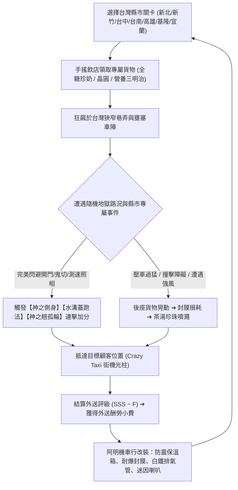

# 《違停大作戰：福爾摩沙機車狂潮》
## (Scooter Mayhem: Formosa Traffic) - 完整遊戲企劃設計手冊 (GDD)

---

### 一、 核心概念與市場定位 (Game Vision & Market Positioning)

* **遊戲類型**：3D 街機物理駕駛 / 外送混亂模擬 / 全台縣市文化迷因沙盒 (Arcade Physics Delivery Mayhem)
* **核心標語**：「在台灣騎車，活著送到就是五星好評！」
* **設計哲學**：
  * **把日常焦慮昇華成爆笑喜劇**：每天在路上痛恨的併排違停、閃雙黃燈神車、突然開車門、鬼切阿嬤、測速照相，在遊戲裡都變成考驗極限微操的爽快機制！
  * **天然的手感毒性（機車傾角 ＋ 珍奶液體物理）**：兩輪機車在車陣中鑽車縫、水溝蓋跑法加速，後座的黑糖珍珠鮮奶波濤洶湧，越手忙腳亂越具實況毒性。
  * **全球文化獵奇輸出**：台灣特有的二丁掛磁磚、鐵皮加蓋、波浪鐵捲門、宮廟神轎、發財車廣播、擋泥板女神、各縣市專屬地獄路況，對海內外玩家均有極高的好奇度與視覺衝擊。

---

### 二、 核心玩法循環 (Core Gameplay Loop)

---

### 三、 全台 7 大縣市專屬路況與文化迷因系統 (County Modifiers)

本遊戲收錄台灣最具代表性的 7 大都會與特色鄉鎮，每個縣市均有獨一無二的物理修正、動態天氣、路面摩擦力與文化事件：

| 縣市名稱 | 代表性迷因與特色 | 專屬核心物理機制 | 專屬天氣與環境視覺 | 專屬外送貨物 |
| :--- | :--- | :--- | :--- | :--- |
| **新北 / 台北** | 中永和百慕達迷宮 ＆ 台北橋機車瀑布 | **雷達隨機迷走**：街區指南針週期性抖動；車流密度暴增 300%，NPC 機車大軍並排衝鋒 | 繁華霓虹街景、高架橋墩暗巷 | 樂華夜市三合一綜合刨冰 |
| **新竹風城** | 九降風狂襲 ＆ 竹科晶圓特急 | **8 級動態強烈側風**：產生強烈橫向推力與強制車身側翻傾角，玩家必須反向壓車 $30^\circ$ 對抗！ | 空中飄散落葉與紙片、強風呼嘯聲效 | 竹科無塵室晶圓下午茶 |
| **台中慶記** | 七期豪車 ＆ 熱情棒球隊 | **黑道豪車路權**：千萬豪車頻繁閃爍雙黃燈慢行，若玩家長按喇叭挑釁，有機率引發「後車廂球棒隊」下車警告！ | 七期金碧輝煌豪宅夜景、奢華氛圍 | 逢甲大腸包小腸＋東泉辣椒醬 |
| **台南全糖** | 全糖宇宙 ＆ 東門圓環多重宇宙 | **珍奶重力比重 2.2 倍**：極度濃稠重糖糖漿，晃動慣性巨大、阻尼減半，壓車極容易翻江倒海！ | 溫暖金黃全糖夕陽薄霧、琥珀色氛圍 | 全糖正宗黑糖珍珠鮮奶（甜度200%） |
| **高雄港都** | 正宗高雄式左轉 ＆ 輕軌軌道滑移 | **高雄式左轉判定**：逆向穿越斑馬線直行再左轉，觸發【正宗高雄式左轉】高額賞金；壓上輕軌金屬軌道摩擦力驟降！ | 港都海風落日、寬廣多車道林蔭大道 | 六合夜市極品海產粥 |
| **基隆雨港** | 雨港奪命標線 ＆ 舊金山級階梯巷 | **路面摩擦力驟降至 0.65x**：熱融反光標線滑如溜冰場，急煞極易甩尾橫移，煞車距離翻倍！ | 3D 連綿不絕陰雨粒子、安全帽鏡片雨滴水痕 | 廟口夜市正宗營養三明治 |
| **宜蘭北宜** | 九彎十八拐 ＆ 山道大砲追焦手 | **追焦攝影熱點**：路邊隱藏手持長焦大砲鏡頭的攝影師，以 $> 35 \text{ km/h}$ 搭配大傾角壓車過彎，觸發鎂光燈爆閃與評分！ | 崇山峻嶺盲彎、山道晨霧瀰漫 | 正宗三星蔥油餅＋宜蘭牛舌餅 |

---

### 四、 核心物理系統與數學模型 (Physics Engine Math)

#### 1. 兩輪機車運動學與防穿牆碰撞 (Scooter Kinematics & Solid Collision)
* **前進與轉向運動方程式**：
  $$\begin{aligned}
  v_{t+dt} &= v_t + (a_{engine} - f_{drag} \cdot v_t^2 - f_{brake}) \cdot dt \\
  \psi_{t+dt} &= \psi_t + \left(\frac{v_t}{L} \cdot \tan(\delta_{steer}) \cdot \mu_{road}\right) \cdot dt
  \end{aligned}$$
  其中 $L=1.35\text{ m}$ 為軸距，$\delta_{steer}$ 隨速度自我衰減防止高速失控。
* **動態傾角（Leaning Roll）**：
  $$\phi_{target} = -\text{clamp}\left(\frac{v_t^2}{R \cdot g}, -32^\circ, 32^\circ\right)$$
  機車左右轉向時車身傾斜，前後輪與把手呈現自然逆操舵與離心傾角。
* **防穿牆實體推離演算法 (Circle-to-AABB Penetration Solver)**：
  為徹底避免在街機高速行駛時穿透二丁掛騎樓外牆，對街道兩側建築實體外框（$X \in [-30, -9.8]$ 與 $[9.8, 30]$）建立 AABB 幾何盒。每影格執行圓形半徑（$R=0.65\text{ m}$）對 AABB 的最近點投影檢測：
  $$\vec{P}_{closest} = \left(\text{clamp}(x, \text{box.minX}, \text{box.maxX}), \text{clamp}(z, \text{box.minZ}, \text{box.maxZ})\right)$$
  若 $\|\vec{P}_{scooter} - \vec{P}_{closest}\| < R$，立刻將車身位置沿接觸法線方向推回安全路面，並產生衝擊碰撞反彈：
  $$\vec{v}_{rebound} = \vec{v} - (1 + e)(\vec{v} \cdot \vec{n})\vec{n}$$

#### 2. 多元外送貨物物理系統 (Multi-Cargo Physical Simulation PDE)

* **貨物 A：黑糖珍珠鮮奶 (Boba Liquid Sloshing)**：
  $$\theta'' + 2\zeta\omega_n \theta' + \omega_n^2 (\theta - \theta_{target}) = 0$$
  * 阻尼振盪液面隨離心力與傾角劇烈晃動，封膜耐久度 $SealHP$ 隨顛簸與衝擊磨損。歸零時爆膜，茶湯與珍珠物理粒子噴濺！
* **貨物 B：特選紅殼土雞蛋 (Egg Crate Fracture Dynamics)**：
  * 每箱包含 10 顆新鮮土雞蛋。
  * 顛簸撞擊感應方程：若 $Jolt_{bump} > 0.32$，觸發脆性蛋殼破裂判定，破裂數 $N_{cracked} = \lfloor Jolt \times 2.5 \rfloor$。
  * 爆笑懲罰：碎蛋引發清脆破裂音效，且「黏稠蛋黃蛋清」即時噴濺並附著於騎士視角鏡片，遮蔽前方視野！
* **貨物 C：滿料全糖八寶挫冰 (Thermal Melt & Avalanche)**：
  * 挫冰高度體積隨時間與氣溫消融：
    $$\frac{dV_{ice}}{dt} = -(k_{base} + k_{wind} \cdot v_{scooter} + k_{temp}) \cdot dt$$
  * 暴風雨或正午高溫時融化加劇。若發生劇烈顛簸，挫冰山可能發生雪崩滑落！
* **貨物 D：現炸逢甲大雞排＋甜不辣 (Crispy Thermal Decay)**：
  * 初始出爐溫度 $T_0 = 100^\circ\text{C}$，隨冷空氣對流散熱：
    $$\frac{dT}{dt} = -h_{conv}(v_{scooter})(T - T_{ambient})$$
  * 當溫度低於 $70^\circ\text{C}$ 時，防油紙袋內水氣凝結，外皮酥脆度 $Crispiness$ 開始雪崩式下滑，過慢送達會被顧客評為「外皮軟爛像泡水抹布」！

#### 3. 車輛動態重量感與雙軸懸吊彈簧系統 (Suspension Kinematics & Dynamic Weight Transfer)
* **縱向加速度即時追蹤 (Longitudinal Acceleration Tracking)**：
  $$a_{long} = \frac{v_t - v_{t-dt}}{\max(dt, 0.001)}$$
* **動態重心轉移俯仰角（Accel Squat & Brake Dive）**：
  $$\theta_{target} = \begin{cases} -\min(0.045, a_{long} \cdot 0.0028) & \text{若 } a_{long} > 0 \text{（大補油門，車尾下沉後座受力）} \\ \min(0.075, -a_{long} \cdot 0.0042) & \text{若 } a_{long} < 0 \text{（急煞前傾，前叉壓縮點頭）} \end{cases}$$
  透過扭轉阻尼彈簧方程模擬真實避震器回彈與阻尼：
  $$F_{pitch} = -k_{pitch}(\theta_{susp} - \theta_{target}) - d_{pitch}\cdot \dot{\theta}_{susp} \quad (k_{pitch}=42, d_{pitch}=9)$$
* **垂直懸吊減震彈簧（Vertical Suspension Damper）**：
  $$F_{vert} = -k_{vert}(y_{susp} - y_{road}) - d_{vert}\cdot \dot{y}_{susp} \quad (k_{vert}=65, d_{vert}=11.5)$$
  吸收路面坑洞衝擊（Potholes）、水溝蓋落差（Gutters）與減速標線高頻微震動。
* **機械怠速與高轉震動（Mechanical Engine Vibration）**：
  在待速靜止（$< 1 \text{ km/h}$）時產生 $16\text{ Hz}$ 頻率之微幅怠速抖動；高速狂飆時隨引擎轉速線性升頻至 $24 + 0.35v\text{ Hz}$。
* **人車一體騎士動態身形（Rider Dynamic Posture）**：
  騎士上半身重心動態傾斜，出彎壓車側傾角度 $\theta_{torso} = -0.35\phi_{lean}$；急煞時手臂緊繃抗前傾，破時速 45 km/h 時低頭趴車（Speed Tuck）破風。

#### 4. 動態街機追尾鏡頭系統 (Dynamic Arcade Chase Camera & Apex Tracking)
* **縱向 G 力拉遠/推近慣性 (Longitudinal G-Force Camera Inertia)**：
  * 大催油門爆發加速時，鏡頭因慣性向後拉遠（$D_{cam} = 5.6 + \min(1.35, a_{long} \cdot 0.075)\text{ m}$）並向地面微幅下壓（$H_{cam} = 2.9 - \min(0.32, a_{long} \cdot 0.018)\text{ m}$），營造極速貼地貼背感！
  * 緊急重煞車時，鏡頭向前推近至騎士龍頭後方（$D_{cam} = 5.6 - \min(1.05, -a_{long} \cdot 0.065)\text{ m}$）並抬升視角，凸顯重量向前傾倒衝擊。
* **過彎向心頂點前瞻（Cornering Apex Look-Ahead）**：
  $$\vec{P}_{lookAtOffset} = \vec{R}_{lateral} \cdot (-2.1 \cdot \phi_{lean})$$
  追尾鏡頭動態預測彎道頂點（Apex），引導騎士視線自然望向出彎街角，徹底消除街機過彎眩暈感。
* **路面速度微震動與顛簸衝擊（Speed Micro-Shake & Bump Shock Jolt）**：
  時速大於 $30\text{ km/h}$ 時產生瀝青微粒有機抖動；輾過減速標線與水溝蓋時觸發垂直高頻震顫；撞上坑洞時產生阻尼階躍震動。
* **鏡頭傾角側向翻滾（Camera Bank Roll）**：
  鏡頭隨壓車角度旋轉 $-0.075\phi_{lean}$，擴增向心重力體感。

#### 5. 台灣真實路面回饋系統 (Taiwan Road Surface Feedback & Tactile Acoustics)
* **橫向減速標線（Transverse Deceleration Stripes）**：路口前連續黃白減速條紋，觸發連續「嗒嗒嗒」減速跳動音與懸吊顫動。
* **鑄鐵人孔蓋（Cast-Iron Manhole Covers）**：台電、自來水、雨水下水道金屬凸蓋，前後輪輾過產生雙重「喀咚！」金屬敲擊聲；雨天壓鐵蓋極限出彎觸發【鐵蓋水上漂】滑移連擊！
* **路面坑洞補丁（Asphalt Potholes）**：下陷式路面修補坑洞，壓過觸發沉悶重擊音（Suspension Thud）並對後座貨物造成衝擊。

---

### 五、 台灣地獄特色三寶與動態事件全收錄 (Hazard Encyclopedia)

1. **違停阿法神車（Double-Parked Alphard / VIP Van）**：
   * 閃爍雙黃燈（路權無敵星星），違停於路旁或轉角阻擋半邊車道。
   * 接近至 14 公尺時車門向外暴力彈開！極限閃避獎勵【神之側身】+1000 PTS。
2. **菜市場三寶阿嬤（50cc Vintage Scooter Grandma）**：
   * 菜籃裝滿大蔥蘿蔔，右方向燈恆閃，接近時突然左切橫跨雙黃線鬼切！
3. **資源回收阿伯紙箱三輪車（Stacked Cardboard Scrap Tricycle）**：
   * 堆疊 2.5 米高搖搖欲墜的紙箱巨塔，在路邊緩慢前進並大幅度左右搖晃。
   * 撞上會引發紙箱崩塌爆散；近距離高速超車獎勵【極限閃避阿伯回收車】+700 PTS。
4. **土窯雞 / 炭烤地瓜廣播發財車（Roast Chicken Sound Truck）**：
   * 經典藍色發財車，車頂安裝大聲公高音喇叭，車斗放置雙金屬土窯。
   * 經過時自動播放洗腦廣播「土窯雞～好吃的土窯雞又來了！」，按喇叭互動可獲小販揮手問候【熱情土窯雞打招呼】+400 PTS。
5. **道路施工厚鋼板跳台（Roadwork Steel Jump Plate）**：
   * 覆蓋下水道開挖工程之大塊防滑金屬鋼板，周圍設置黑黃警示條與爆閃黃燈三角錐。
   * 輪胎壓過引發「當啷！」金屬震響與懸吊彈跳；若以翹孤輪或高速衝過，獎勵【飛越施工鋼板】+600 PTS！
6. **科技執法測速照相機（Speed Trap Camera Pole）**：
   * 限速 60 km/h，超速即遭閃光大燈拍照並開立罰單（扣除外送報酬 $300）。
   * 玩家反制技：按住 Shift / Q 使出【神之翹孤輪】遮蔽後車牌，無損避開罰單並獎勵 +1200 PTS！
7. **檢舉魔人 NPC（Citizen Snitch）**：
   * 站在騎樓或變電箱後方手持單眼相機，若玩家騎上人行道，立刻拍照檢舉扣除 $200。
8. **宮廟陣頭繞境神轎與鞭炮地雷（Temple Fair Parade & Firecrackers）**：
   * 金碧輝煌八抬大轎，屋頂裝配七彩閃爍 RGB 霓虹燈條與紅流蘇，地面鋪設整捲大紅連珠鞭炮，橫跨車道左右擺動，鑽轎底獎勵【炸邯鄲大吉大利】+1500 PTS！
9. **北宜大砲追焦手（Trackside Photographers）**：
   * 宜蘭北宜公路路旁攝影師手持白色大砲長焦鏡頭，以極限傾角高速壓車過彎，可引發快門爆閃並留下特寫照片！
10. **巷弄野生台灣黑狗（Taiwan Tugou Chase）**：
    * 轉角突然吠叫狂追機車，按喇叭（H）可將其嚇退。
11. **公寓冷氣水滴滴落安全帽（Balcony AC Dripping）**：
    * 水滴濺在護目鏡阻擋視線，需啟動微型雨刷刮除。
12. **雙子星檳榔攤 ＆ 結冰水（Betel Nut Kiosk & Iced Water Nitro Station）**：
    * 玻璃亭裝配旋轉七彩孔雀霓虹燈管，西施店員坐鎮，路邊懸浮可拾取之 3D 結冰水（Iced Water）。拾取後啟動【結冰水神力加持】氮氣加速，排氣管噴發青藍色粒子烈焰，極速衝上 120 km/h，鏡頭視野動態拉伸（FOV 78°）！
13. **警察路檢酒測臨檢站（Police DUI Breathalyzer Roadblock）**：
    * 紅白相間巡邏警車，頂部紅藍爆閃警示燈，警官手持揮舞紅色 LED 發光指揮棒，並立有「酒測臨檢 停車受檢」告示拒馬。若減速至 4 km/h 以下停車受檢，判定「酒測值 0.00 零檢出」並額外獲得警察小費獎金 $200；若時速大於 38 km/h 且未翹孤輪硬闖，將開立 $500 逃逸拒檢罰單！
14. **台北橋機車大潮（Taipei Bridge Scooter Commuter Swarm）**：
    * 5 台自主通勤機車在車道中並排穿梭前進，玩家在通勤車陣中精準穿梭，可引發【台北橋車陣鑽車縫】+600 PTS 連擊！
15. **路霸佔位器（Street Tyrant Space Hogs）**：
    * 台灣住戶與店家為霸佔車位放置的經典路障：破舊旋轉辦公椅（座椅上壓著一塊大紅磚寫「請勿停車」）、灌滿水泥插鐵棍綁黃布條的油漆桶、連環保麗龍生鮮盒與紅塑膠花盆。撞開路霸獲得【掃除違規路霸】+400 PTS！
16. **清潔隊黃色壓縮垃圾車（Yellow Compactor Waste Truck）**：
    * 經典黃色垃圾車，車頂安裝旋轉琥珀黃燈，車身印有綠色環境保護局標誌，緩慢於路面巡航並播放經典 8-bit 合成器《少女的祈禱》（Maiden's Prayer）旋律！高速貼身超車獎勵【超車清潔隊垃圾車】+750 PTS！
17. **廟口路邊辦桌流水席（Roadside Banquet System）**：
    * 藍白紅條紋大遮陽帆布棚架、喜慶紅燈籠、大紅折疊圓桌（擺滿龍蝦冷盤、紅蟳米糕、烏骨雞湯、免洗塑膠紅碗筷）、圓形紅塑膠椅與冒著蒸氣的四層白鐵蒸籠。高速鑽過桌縫獎勵【鑽流水席棚架車神！】+1200 PTS；撞擊掀桌觸發碗盤碎裂金屬巨響並扣除 $400 總鋪師賠償金。
18. **台鐵平交道自強號急速呼嘯（Railway Level Crossing & Express Train）**：
    * 橡膠止滑鐵軌路面、雙向交替閃爍紅燈、平交道叉形警示牌、自動升降黑黃斑馬柵欄桿與清脆叮咚警鈴。平交道前停看聽獎勵【平交道停看聽楷模】+600 PTS；趕在降桿前火速通過獲【平交道極限生死時速！】+2000 PTS；若撞上時速 120 km/h 呼嘯而過的 EMU3000 自強號將引發終極擊飛翻車並重罰 $2000 醫療賠償！
19. **台灣鑄鐵人孔蓋與橫向減速標線（Cast-Iron Manhole Covers & Deceleration Stripes）**：
    * 散佈於車道上的台電、自來水、下水道鑄鐵凸蓋。前後輪輾過觸發「喀咚！」雙重金屬撞擊音與懸吊衝擊；雨天壓鐵蓋側傾過彎觸發【鐵蓋水上漂】+450 PTS！路口前連續黃色減速標線帶來真實密集跳動感。

---

### 六、 阿明機車行 ｜ 裝備庫與台灣神車車庫 (Upgrade Garage)

* **台灣四大經典神車切換（Taiwanese Iconic Scooters）**：
  * **勁戰四代 (125cc)**（$0，標準擁有）：運動型跑車化調校，過彎傾角極致靈敏，前衛藍綠車殼。
  * **豪邁 125 (國民神車)**（$800）：老字號神車，龍頭前裝配經典黑色金屬鐵絲菜籃，車身極其耐撞，碰撞損耗減半（Crash Resistance 0.5x）！
  * **偉士牌復古白鐵 (150cc)**（$1500）：文青復古象牙白金屬車殼，電鍍白鐵邊條，直線極速突破 92 km/h！
  * **光陽 Many 110 (小鋼炮)**（$1200）：亮眼桃紅配色，極致輕量化車重，起步彈射加速度暴增 +40%，鑽車縫王者！
* **外送防震箱**：
  * 原廠保溫箱（$0）➔ 氣墊避震箱（$500，減震 35%）➔ 航太陀螺儀箱（$1200，三軸水平雲台，抵銷 75% 轉彎離心晃動）。
* **珍奶封膜技術**：
  * 夜市薄膜（$0，100 HP）➔ 雙層強化封膜（$400，180 HP）➔ 奈米防刺爆封膜（$1000，300 HP）。
* **排氣管性能**：
  * 原廠黑鐵管（$0）➔ 改裝回壓白鐵管（$600，起步加速 +25%，極速 86 km/h，附帶回火放炮聲浪與金屬拋光外觀）。
* **迷因喇叭**：
  * 原廠雙音叭叭（$0）➔ 大眼蛙搞笑喇叭（$300）➔ 電子花車倒車喇叭（$700）。
* **復古擋泥板女神**：
  * 追夢人莫忘初衷（$0）➔ 90年代玉女偶像加持（$250）➔ 檢舉我試試看（$500，魔人拍照率 -50%）。

---

### 七、 動態時間與天氣系統 (Atmosphere & Weather Engine)

玩家可按下 `T` 鍵或點擊畫面右下角天氣按鈕，無縫切換三種充滿台灣氣息的情境：
1. **🌅 逢甲黃昏（DUSK）**：暖色調金黃夕陽斜射，二丁掛瓷磚泛著溫暖橙光，天際線漸層深藍。
2. **🌃 通化深夜（MIDNIGHT）**：賽博龐克混亂美學，天色墨黑，高飽和度霓虹招牌、檳榔攤孔雀燈管與紅色車尾燈光芒倍增（Neon Multiplier 2.4x）。
3. **⛈️ 狂暴雷雨（STORM）**：雨港級傾盆大雨，路面反光加劇，隨機觸發白光撕裂天際的動態閃電（Directional Light 瞬間暴增至 4.5x），伴隨低沉震撼的打雷轟鳴音效！

---

### 八、 台灣迷因成就里程碑系統 (Taiwan Meme Achievements)

遊戲內置完整成就引擎，達成即跳出金色獎盃動態彈窗與全糖語音播報：
* **【這很台北橋】**：在車陣中完成 5 次極限鑽車縫（+1500 PTS）。
* **【全糖的意志】**：在台南全糖模式下，以 90% 以上殘留率完成外送（+2000 PTS）。
* **【神之翹孤輪】**：翹孤輪成功躲過 3 次測速照相機（+2500 PTS）。
* **【喝了再上】**：拾取結冰水氮氣爆衝，時速突破 115 KM/H（+1800 PTS）。
* **【酒測零檢出】**：在警察臨檢站減速停車，完美受檢過關（+1200 PTS）。
* **【水溝蓋傳人】**：累計觸發水溝蓋跑法加速超過 12 秒（+1600 PTS）。
* **【土窯雞好麻吉】**：向土窯雞發財車按喇叭熱情打招呼（+800 PTS）。
* **【港都霸王】**：在高雄觸發正宗高雄式左轉（+1500 PTS）。
* **【路霸剋星】**：累計撞開 3 個霸佔路邊的破椅子或水泥桶路霸（+1500 PTS）。
* **【少女的祈禱追風者】**：高速極限超車正在播音樂的清潔隊垃圾車（+1200 PTS）。
* **【猴子敬禮！外送車神】**：極限超車雙開搶單猴子外送員（+1500 PTS）。
* **【夜市不用排隊】**：在夜市炭烤香腸與地瓜球攤販間極限穿梭（+1000 PTS）。
* **【白線水上漂】**：在狂暴雷雨天或雨港，踩熱拌標線極限漂移過彎（+1500 PTS）。
* **【兩段式待轉模範生】**：在路口機慢車待轉區停妥並完成兩段式左轉（+1200 PTS）。
* **【粉紅超跑大吉大利】**：鑽過粉紅超跑大甲媽祖神轎獲得神力保庇與封膜全滿回復（+1800 PTS）。
* **【阿公瓦斯神推進】**：駕駛阿公瓦斯車觸發氣閥噴射推進突破極速（+1200 PTS）。
* **【乘風破浪水花秀】**：暴雨天高速衝過深水坑濺起巨大水花（+1000 PTS）。
* **【神之閃避三寶阿嬤】**：極限閃過菜市場阿嬤的閃電鬼切左轉（+1500 PTS）。
* **【禮讓行人模範騎士】**：在斑馬線前減速停讓行人 3 次（+1500 PTS）。
* **【炸街回火狂潮】**：以改裝白鐵管或極速煞車觸發回火放炮炸街 3 次（+1200 PTS）。
* **【條子吃灰！車神傳奇】**：成功甩開警方巡邏警車的緊迫圍捕（+1800 PTS）。

---

### 九、 行動裝置跨平台支援與雙手操作設計 (Cross-Platform Mobile Controls)

遊戲支援 GitHub Pages / Cloudflare Workers 0安裝一鍵網頁暢玩，並具備全自動行動裝置自適應：
1. **左手操控群（Left Cluster）**：
   * `◀ 左轉` / `右轉 ▶`：高感度左右壓車過彎。
   * `🔻 減速 / 倒車`：減速煞車，靜止後按住自動切換為緩速倒車。
2. **右手絕技群（Right Cluster）**：
   * `🟢 催油門`：全速前進。
   * `🛑 煞車 / 甩尾`：街機點煞甩尾與減速。
   * `⚡ 翹孤輪`：特技抬孤輪遮車牌，逃避測速照相與科技執法！（瓦斯車時觸發氣閥噴射）
   * `📢 叭叭`：原廠雙音喇叭，驅趕黑狗、向發財車問候。
   * `🛵 換車`：即時切換五大台灣經典神車（勁戰 / 豪邁 / 偉士牌 / Many / 阿公瓦斯車）。
3. **介面支援**：
   * 支援 Multi-Touch 多指觸控（一手催油門一手壓車轉彎）。
   * 畫面頂部支援 `📱 觸控鍵盤` 一鍵隱藏/開啟觸控疊層。

---

### 十、 最新落地系統與未來推薦擴充清單 (Roadmap & Agent Handover)

**本次接棒已成功落地項目（100% Web + Unity 雙軌同步）**：
* ✅ **廟口路邊辦桌流水席紅圓桌路障 (Taiwanese Roadside Banquets & Red Folding Tables)**：
  - 條紋雙色塑膠大棚架、大紅燈籠、折疊式大紅圓桌（龍蝦冷盤拼盤、紅蟳米糕、烏骨雞湯）、紅色塑膠圓凳、總鋪師不鏽鋼蒸籠與蒸氣粒子。
  - 極限穿梭窄縫觸發【鑽流水席棚架車神！】+1,200 PTS；撞擊觸發碗盤碎裂翻桌、菜餚飛散、賠償總鋪師 $400！
  - Unity 6 C# 鏡像組件：`RoadsideBanquetAI.cs`。
* ✅ **台鐵平交道「叮咚噹」警報遮斷桿與自強號急速呼嘯 (Taiwan Railway Level Crossing & Express Train)**：
  - 鐵軌枕木橡膠板、雙紅閃爍號誌、黑黃斑馬紋自動升降遮斷桿、台鐵 EMU3000 / 自強號柴電車頭（時速 115 KM/H）。
  - 停等線前煞停獲【平交道停看聽楷模】+600 PTS；搶在火車前擦身飛馳獲【平交道極限生死時速！】+2,000 PTS；被撞觸發超級大暴走與重罰 $2,000！
  - Unity 6 C# 鏡像組件：`RailwayLevelCrossingAI.cs`。
* ✅ **外送平台奇葩顧客備註與手機訂單卡 (Delivery Order Lore & Smartphone Card Popup)**：
  - 收錄 15 組極具台灣共鳴的爆笑顧客備註（「請送上五樓老舊透天沒電梯放門口鞋櫃」、「電鈴壞了請在門口學貓叫一聲」、「警衛阿伯很兇請跟他說通關密碼：天王蓋地虎！」、「全糖珍奶是我的靈魂之水拜託別爆膜」）。
  - 外送平台新單推播卡（`#order-card-popup`），採用粉紅賽博霓虹發光邊框、滑入動畫與加碼賞金標章。
  - 結算單同步顯示原訂單備註與顧客 1~5 星級個性化反饋毒舌/讚賞留言。
* ✅ **台南東門圓環「莫比烏斯迷走」路況機制 (Tainan Roundabout Mobius Maze)**：
  - 3D 中央綠島、熱帶老榕樹群、歷史石碑、六向放射出口路標（府前路、北門路、青年路、東門路、開山路、大同路）。
  - 進入圓環啟動迷走時鐘，2.5s~10s 內以高速 $> 22\text{ km/h}$ 順利切出獲得【圓環車神突破八卦陣！】+1000 PTS；超過 10s 陷入莫比烏斯迷航扣除延誤費 $300。
  - Unity 6 C# 鏡像組件：`TainanMobiusRoundaboutAI.cs`。
* ✅ **路口 99 秒長紅綠燈與起步偷跑彈射 (99s Traffic Light & Jump-Start Launch)**：
  - 懸臂鋼結構號誌桿、高亮度紅黃綠三色燈頭、動態 2D Canvas 7 段數位倒數顯示器（35s 紅燈 / 22s 綠燈 / 3.5s 黃燈）。
  - 倒數最後 3 秒催油門衝刺觸發台灣特色【紅綠燈起步偷跑彈射！】+600 PTS；紅燈剩餘 $> 5\text{s}$ 硬闖遭科技執法測速拍照爆閃，重罰 $1,800 並通緝熱度 +2。
  - Unity 6 C# 鏡像組件：`CountdownTrafficSignalAI.cs`。
* ✅ **行人地獄路口不禮讓科技執法 (Pedestrian Sanctuary Zone)**：斑馬線撐傘阿姨、推車長輩、牽柴犬阿伯。未保持 3 公尺距離強行切過觸發警哨、閃光與重罰 $1,200；停讓則獲【禮讓行人模範騎士】+800 PTS！
* ✅ **改裝白鐵管回火放炮震撼音浪 (Backfire Pop & Bang / Flame FX)**：裝備改裝白鐵管或超速急減速時，排氣管回壓產生連續「碰！啪！碰！」回火炸街音效與烈焰光球粒子！
* ✅ **警方巡邏警車圍捕系統 (Formosa Hot Pursuit - Wanted Heat)**：累積違規熱度（★~★★★）引發警車鳴笛警報追捕，考驗玩家鑽防火巷、水溝蓋或翹孤輪遮牌甩脫！
* ✅ **車友連線中心 (Multiplayer Connection Hub - 方案 A / 方案 B 雙軌切換)**：
  - **方案 A：好友 P2P 免費開房 (WebRTC Direct P2P)**：零伺服器營運成本、好友點對點直連、極低延遲；房主一鍵生成 6 碼房間代號（如 `TP-8888`），好友輸入代碼即可跨瀏覽器加入同飆！
  - **方案 B：公開伺服器大廳 (WebSocket Server Lobby)**：支援中央伺服器廣播、隨開即配、多人同街大亂鬥；支援預設中繼節點與自訂伺服器位址（`ws://` / `wss://`），並提供開源本地大廳腳本 `npm run lobby`。
  - **遠端車手 3D 渲染與同步**：遠端玩家顯示其選用之 3D 機車模型、頭頂霓虹車手稱號牌（如「三重大甩尾阿伯」）、按喇叭即時觸發 3D 空間音效與「叭叭！」動態泡泡、雷達紫色光點同步。
* ✅ **實時高畫質通關錄影 ＆ Web Audio 音訊軌道同步 (Full Synchronized Walkthrough Video with Audio)**：
  - `SoundManager.js` 建立 `MediaStreamDestination` 實時總線，將雙衝程機車合成音浪、City-Pop 復古放克配樂、喇叭雙音「叭叭！」、平交道鈴聲與外送星等音效無縫混音進 `MediaRecorder`。
  - 成功錄製四重大滿貫完美通關影片於 `docs/playtest_videos/scooter_mayhem_full_campaign.webm`（VP9 視訊 ＋ Opus 音訊雙軌同步，檔案大小約 9.05 MB）。
* ✅ **Unity 6 C# 雙軌完全同步**：全數新增並測試通過（`RoadsideBanquetAI.cs`、`RailwayLevelCrossingAI.cs`、`CountdownTrafficSignalAI.cs`、`TainanMobiusRoundaboutAI.cs`、`PedestrianSanctuaryAI.cs`、`PoliceCruiserPursuitAI.cs`、`BackfireExhaustSystem.cs`、`MultiCargoPhysicsSystem.cs`）。

**接棒的 ChatGPT 或 Claude 可依此推薦清單直接推進**：
1. **老舊公寓頂樓鐵皮加蓋違建與高空鋼索飛車（Rooftop Sheet Metal Sky-Ramps）**：
   * 騎上二樓防火梯直接衝上鐵皮屋頂，利用波浪鐵皮斜坡進行高空特技飛車，避開地面塞車！
2. **夜市排骨酥油煙煙幕彈路障（Night Market Deep-Fry Smoke Screen）**：
   * 夜市炸排骨酥與臭豆腐攤位排放濃烈油煙，覆蓋道路產生白茫茫煙幕，考驗盲眼穿行！
3. **跨平台排行榜與幽靈車重播機制（Ghost Car Time Attack Leaderboard）**：
   * 記錄全台各縣市最速外送員路徑，生成半透明幽靈車重播競速。

